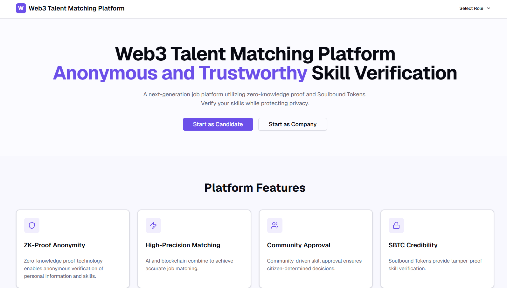

# Web3 Talent Matching Platform

A decentralized job matching platform utilizing zero-knowledge proofs and Soulbound Tokens for privacy-preserving skill verification and anonymous job matching.

## 🌟 Features

### Core Functionality

- **Zero-Knowledge Proof Verification**: Verify qualifications without revealing personal information
- **Soulbound Token (SBT) Credentials**: Tamper-proof, non-transferable skill certificates
- **Anonymous Job Matching**: Match candidates with employers based on verified skills, not identity
- **Community-Driven Approval**: Decentralized skill verification through human approvers
- **Community Governance**: Community voting on platform rules and policies

### User Roles

#### 1. **Candidate (Job Seeker)**
- Dashboard with activity overview and statistics
- Work history management with detailed experience tracking
- Skill credential verification and SBT issuance
- Job search with advanced filters and match scoring
- Matching dashboard to track application status
- Chat with employers after successful matching

#### 2. **Employer (Company)**
- Dashboard with recruitment metrics and recent activity
- Job posting management with applicant tracking
- Candidate search with skill-based filtering
- Matching system to manage approved candidates
- Anonymous applicant review with ZK-proof verification
- Communication with matched candidates

#### 3. **Approver (Skill Verifier)**
- Dashboard with review statistics and urgent items
- Pending reviews queue with priority sorting
- Detailed credential review with evidence evaluation
- Approval history with search and filtering
- Score applications based on multiple criteria
- Issue Soulbound Tokens for verified skills

#### 4. **Community Member (Governance)**
- Dashboard with governance statistics and activity
- Proposal listing with voting progress
- Create new governance proposals
- Voting history with detailed results
- Participate in community decision-making
- Track proposal outcomes and impact

## 🎨 Screenshots

## 🧭 Navigation

The platform features a **role-based dropdown menu** in the top-right corner of the main navigation:

- **Candidate**: Access dashboard, work history, credentials, job search, and matching
- **Company**: Access dashboard, job management, candidate search, and matching
- **Skill Approver**: Access dashboard, pending reviews, and approval history
- **Operating Community**: Access dashboard, proposals, create proposal, and voting history

Each role has its own **sidebar navigation** with quick access to all features within that role.

## 📱 Complete Screen Overview

### Landing Page (`/`)
**Purpose**: Marketing page introducing the platform

**Sections**:
- Hero with "Web3 Talent Matching Platform" title and value proposition
- Platform Features (4 cards): ZK-Proof Anonymity, High-Precision Matching, Community Approval, SBTC Credibility
- How It Works (3 steps): Register → ZK Proof → Matching
- Get Started with role selection buttons

---

## Candidate Pages (5 pages)

### 1. Candidate Dashboard (`/user/dashboard`)
**Purpose**: Overview of candidate activity and quick actions

**Features**:
- Statistics cards: Active Applications, Verified Credentials, Profile Views, Match Rate
- Recent activity timeline
- Recommended jobs based on skills
- Quick action buttons

**Key Elements**:
- 4 stat cards with icons
- Activity feed with status indicators
- Job recommendation cards with match scores
- Quick navigation buttons

---

### 2. Work History (`/user/work-history`)
**Purpose**: Manage professional experience and employment history

**Features**:
- Add/edit/delete work experiences
- Company, position, dates, description
- Current position indicator
- Skills used per position

**Key Elements**:
- Work experience cards with timeline
- Add experience dialog
- Edit and delete actions
- Current position badge

---

### 3. Skill Verification (`/user/credentials`)
**Purpose**: Request and view skill credential verifications

**Features**:
- List of existing credentials with SBT-style badges
- Status indicators (Verified, Pending, Rejected)
- Request new credential verification
- Enable/disable credentials for matching

**Key Elements**:
- Credential cards with toggle switches
- Issue credential dialog
- Verification status badges
- Proof hash display

---

### 4. Job Search (`/user/job-search`)
**Purpose**: Browse and apply to jobs with ZK proofs

**Features**:
- Job listings with match scores
- Search and filter by skills, type, location
- Match percentage calculation
- ZK proof application process

**Key Elements**:
- Search bar with filters
- Job cards with match badges
- Apply button with ZK proof generation
- Salary and location info

---

### 5. Matching (`/user/matching`)
**Purpose**: Track application status and manage matches

**Features**:
- Active, pending, and closed matches
- Match score display
- Chat initiation for approved matches
- Application status tracking

**Key Elements**:
- Tabs for different match statuses
- Match cards with scores
- Status badges and icons
- Chat buttons for active matches

---

## Company Pages (4 pages)

### 6. Company Dashboard (`/employer/dashboard`)
**Purpose**: Overview of recruitment activity and metrics

**Features**:
- Statistics: Active Jobs, Total Applicants, Active Matches, Profile Views
- Recent applications with match scores
- Active job postings summary
- Quick action buttons

**Key Elements**:
- 4 stat cards with recruitment metrics
- Recent applicant cards
- Job posting summary
- Quick navigation buttons

---

### 7. Job Management (`/employer/jobs`)
**Purpose**: Create and manage job postings

**Features**:
- Job listing with status filters
- Create new job dialog
- Edit/delete job actions
- Applicant count per job

**Key Elements**:
- Job cards with applicant counts
- Create job form
- Status badges (Draft/Open/Closed)
- View applicants button

---

### 8. Candidate Search (`/employer/candidates`)
**Purpose**: Search for qualified candidates

**Features**:
- Candidate listings with match scores
- Filter by experience, skills, availability
- Verified credential counts
- Send invitation to candidates

**Key Elements**:
- Search bar with filters
- Candidate cards with skills
- Match score badges
- View profile and invite buttons

---

### 9. Matching (`/employer/matching`)
**Purpose**: Manage candidate matches and communications

**Features**:
- Active, pending, and closed matches
- Match score display
- Chat access for active matches
- Match status management

**Key Elements**:
- Tabs for match statuses
- Match cards with candidate info
- Status badges
- Open chat buttons

---

### 10. Applicant Review (`/employer/jobs/[id]`)
**Purpose**: Review anonymous applicants with ZK proofs

**Features**:
- Applicant list with match scores
- ZK proof verification results
- Anonymous profile preview
- Approve/reject decisions

**Key Elements**:
- Job requirements sidebar
- Applicant cards with verification status
- Match score visualization
- Approve/reject buttons

---

### 11. Employer Chat (`/employer/chat/[matchId]`)
**Purpose**: Communicate with matched candidates

**Features**:
- Real-time chat interface
- Message history
- Match status updates
- Contract signing workflow

**Key Elements**:
- Chat message list
- Message input
- Match details sidebar
- Status dropdown

---

## Approver Pages (3 pages)

### 12. Approver Dashboard (`/approver/dashboard`)
**Purpose**: Overview of review activity and urgent items

**Features**:
- Statistics: Pending Reviews, Approved Today, Total Reviewed, Approval Rate
- Urgent reviews (2+ days old)
- Recent review decisions
- Quick action buttons

**Key Elements**:
- 4 stat cards with review metrics
- Urgent review alerts
- Recent activity feed
- Quick navigation buttons

---

### 13. Pending Reviews (`/approver/queue`)
**Purpose**: View and manage credential verification requests

**Features**:
- Pending and reviewed tabs
- Request cards with applicant info
- Evidence preview
- Review button

**Key Elements**:
- Tabs for Pending/Reviewed
- Request cards with credential type
- Status indicators
- Review action button

---

### 14. Approval History (`/approver/history`)
**Purpose**: View past review decisions

**Features**:
- Complete review history
- Filter by status, type, candidate
- Score display
- Review comments

**Key Elements**:
- Search and filter controls
- History cards with scores
- Status badges
- Review comment display

---

### 15. Credential Review (`/approver/review/[id]`)
**Purpose**: Detailed review of credential verification request

**Features**:
- Applicant information display
- Evidence preview (documents, links)
- Evaluation criteria checklist
- Quality score slider
- Approve/reject decision

**Key Elements**:
- Two-column layout
- Evidence viewer with external link
- Evaluation checkboxes
- Score slider
- Decision buttons

---

## Community Pages (4 pages)

### 16. Community Dashboard (`/dao/dashboard`)
**Purpose**: Overview of governance activity

**Features**:
- Statistics: Active Proposals, Total Members, Your Votes, Participation Rate
- Active proposals with voting progress
- Recent Community activity
- Quick action buttons

**Key Elements**:
- 4 stat cards with governance metrics
- Active proposal cards with progress bars
- Activity timeline
- Quick navigation buttons

---

### 17. Proposal List (`/dao/proposals`)
**Purpose**: View and participate in governance

**Features**:
- Proposal listing with status
- Create new proposal button
- Voting progress visualization
- Filter by status (Active/Closed)

**Key Elements**:
- Tabs for Active/Closed proposals
- Proposal cards with vote counts
- Progress bars
- Create proposal button

---

### 18. New Proposal (`/dao/new-proposal`)
**Purpose**: Create governance proposals

**Features**:
- Proposal form with title, category, description
- Rationale and implementation details
- Voting period selection
- Submission guidelines

**Key Elements**:
- Multi-field form
- Category dropdown
- Text areas for details
- Voting period selector
- Submit button

---

### 19. Voting History (`/dao/voting-history`)
**Purpose**: View past votes and outcomes

**Features**:
- Complete voting history
- Filter by result, your vote
- Vote statistics
- Proposal outcomes

**Key Elements**:
- 4 stat cards with voting metrics
- Search and filter controls
- History cards with results
- Vote percentage display

---

### 20. Proposal Voting (`/dao/proposals/[id]`)
**Purpose**: View proposal details and cast vote

**Features**:
- Full proposal description
- Voting options (For/Against)
- Real-time vote count
- Voting deadline countdown

**Key Elements**:
- Proposal header with status
- Vote buttons
- Results visualization
- Timeline sidebar
- Vote recording confirmation

---

## 🚀 Technology Stack

- **Framework**: Next.js 16 (App Router)
- **Language**: TypeScript
- **Styling**: Tailwind CSS v4
- **UI Components**: shadcn/ui
- **Icons**: Lucide React
- **State Management**: React Hooks (mock data)

## 💡 Mock Implementation Notes

This is a **UI-only mock** for demonstration purposes:

- All data is hardcoded or generated with mock functions
- No actual blockchain integration or ZK-proof generation
- No real database or backend API
- Authentication is simulated
- File uploads are UI-only (no actual storage)

For production implementation, you would need:
- Smart contracts for SBT issuance
- ZK-proof circuit implementation
- Backend API with database
- IPFS or decentralized storage
- Wallet integration (MetaMask, etc.)
- Real-time messaging infrastructure

## 🎯 Getting Started

1. **Install dependencies**:
   \`\`\`bash
   npm install
   \`\`\`

2. **Run development server**:
   \`\`\`bash
   npm run dev
   \`\`\`

3. **Open browser**:
   Navigate to `http://localhost:3000`

4. **Explore roles**:
   - Use the **role dropdown menu** in the top-right corner to switch between:
     - **Candidate**: 5 pages (Dashboard, Work History, Skill Verification, Job Search, Matching)
     - **Company**: 4 pages (Dashboard, Job Management, Candidate Search, Matching)
     - **Skill Approver**: 3 pages (Dashboard, Pending Reviews, Approval History)
     - **Operating Community**: 4 pages (Dashboard, Proposal List, New Proposal, Voting History)
   - Each role has a sidebar navigation for easy access to all features
   - Or click the role buttons on the landing page to get started

## 📊 Page Count Summary

- **Total Pages**: 20 functional pages
- **Candidate**: 5 pages
- **Company**: 4 pages + 2 detail pages (job detail, chat)
- **Approver**: 3 pages + 1 detail page (review)
- **Community**: 4 pages + 1 detail page (proposal detail)
- **Landing**: 1 page

## 📄 License

© 2025 All rights reserved.
